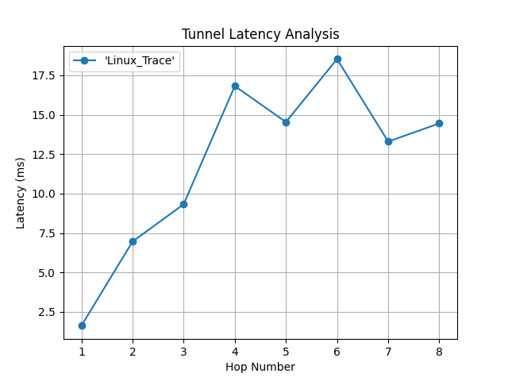

#  Protocol Latency Analyzer

A Python-based hands-on tool that analyzes and visualizes hop-by-hop latency from traceroute data — built to study and simulate GRE, IPSec, and other tunneling behaviors in secure network environments.

This project is part of an ongoing learning initiative to bridge **network automation**, **traffic analysis**, and **cybersecurity concepts** through real labs.

---

##  What This Project Does

- Accepts traceroute output (`.txt`) from Linux
- Extracts average latency for each hop
- Plots hop-by-hop latency graph with labels
- Saves output in `plots/` directory
- Requires **zero code editing** — takes user input dynamically

---





##  Folder Structure

protocol-latency-analyzer/
├── analyzer.py # Main Python script
├── requirements.txt # Dependencies
├── README.md # This file
├── traceroute_samples/ # Store raw traceroute logs here
│ └── tunnel_trace_linux.txt
├── plots/ # Saved output graphs
│ └── latency_plot.png


---

##  How to Use

### Install dependencies

Make sure you are inside your virtual environment (`venv` activated):

```bash
pip install -r requirements.txt

---

### Collect traceroute data
traceroute google.com > traceroute_samples/tunnel_trace_linux.txt

---

## Run the analyzer
python analyzer.py


A prompt will will pop up to:

    Enter path to the traceroute file

    Provide a label for the graph (e.g. "GRE Tunnel")

The output graph will:

    Display on screen

    Be saved as: plots/latency_plot.png
---

